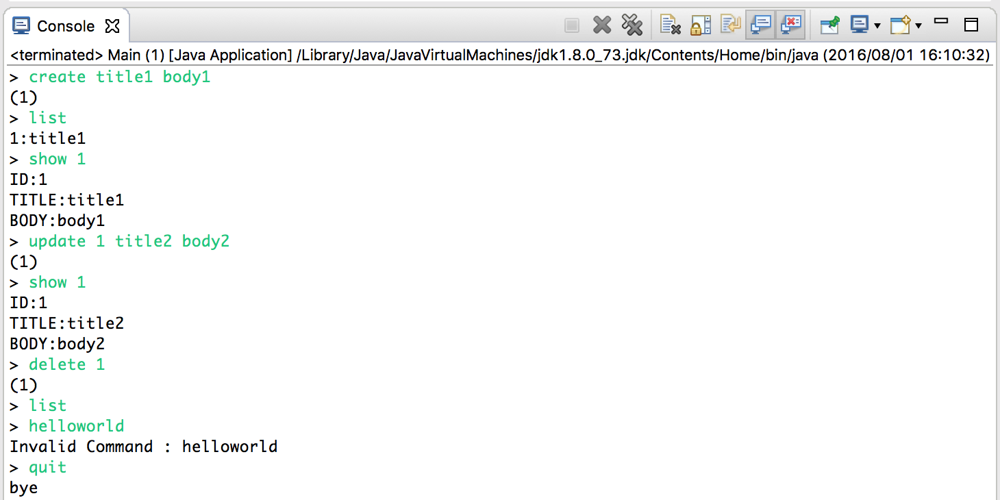
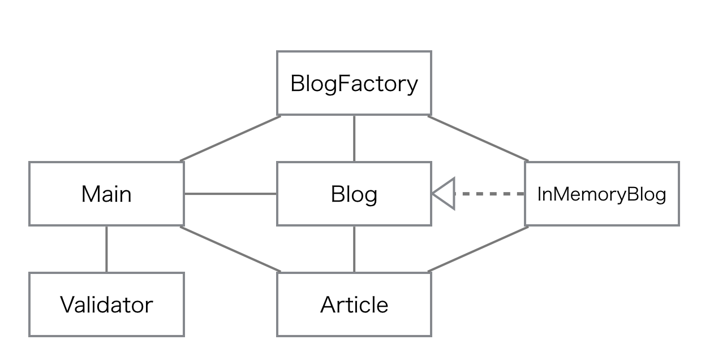

# 総合課題： ブログアプリケーション開発

## 課題概要

コマンドラインで操作するブログアプリケーションを開発します。Eclipse上でblog_appプロジェクトを作成してください。



ブログアプリケーションは以下の入力コマンドを処理します。

|処理|コマンド|
|:--|:--|
| 記事登録処理 | create タイトル 本文 |
| 記事一覧表示処理 |list|
| 記事詳細表示処理 | show ID |
| 記事更新処理 | update ID タイトル 本文 |
| 記事削除処理 | delete ID |
| 終了処理 | quit |

> このブログアプリケーションはファイルなどは使わず、メモリ上にデータを保存します。そのためプログラムを終了すると登録したデータは破棄されます。

<div style="page-break-before: always;"></div>

## プログラム概要

ブログアプリケーションは以下のクラスで構成されます。

|クラス|概要|
|:--|:--|
|Article|記事クラス。|
|Blog|ブログインタフェース。|
|BlogFactory|ブログインスタンスを生成するクラス。|
|InMemoryBlog|ブログクラス。ブログ情報をメモリ上に保存する。|
|Main<br>（作成済み）|起動クラス。|
|Validator<br>（作成済み）|入力チェッククラス。|

### クラス図




### 記事データ仕様

記事データはID、タイトル、本文の3つの項目で構成しています。

|項目名|必須|型|桁|
|:--|:--|:--|:--|
|ID|◯|数値|8桁以内|
|タイトル|◯|文字列|40文字以内|
|本文|◯|文字列|140文字以内|

> 入力チェッククラス（Validator）は上記の仕様のとおり実装しています。

<div style="page-break-before: always;"></div>


## 課題一覧

課題は以下のとおりです。

+ 0.Eclipseプロジェクトの準備
+ 1.記事登録処理
+ 2.記事一覧表示処理
+ 3.記事詳細表示処理
+ 4.記事更新処理
+ 5.記事削除処理
+ 6.記事入力チェック処理

作成したJavaプログラム（拡張子が.javaのもの）を提出すれば課題は完了です。

<div style="page-break-before: always;"></div>

## 課題0 Eclipseプロジェクトの準備

blog_appプロジェクトのsrcディレクトリに以下のファイルをコピーします。

+ Blog.java
+ InMemoryBlog.java
+ Main.java
+ Validator.java

> 本課題ではパッケージは利用しません。Eclipseのsrcディレクトリ直下（デフォルトパッケージ）に配置してください。

ファイルをコピーすると、コンパイルエラーが残るので以下のファイルを新規作成します。

+ Article.java
+ BlogFactory.java

### Article.javaの実装

記事データを表現するクラスです。ID、タイトル、本文というフィールドとアクセサメソッドを定義します。またコンストラクタを実装します。

#### フィールド

|アクセス修飾子|型|名前|
|:--|:--|:--|
| private| Integer | id |
| private| String | title |
| private| String | body |

#### コンストラクタ

|アクセス修飾子|引数|処理概要|
|:--|:--|:--|
| public | なし | 処理は不要 |
| public | String id, String title, String body | 引数で受け取ったid, title, body を<br>フィールドに代入する |

#### メソッド

各フィールドへのgetter/setterメソッドを実装します。

<div style="page-break-before: always;"></div>

### BlogFactory.javaの実装

Blogインスタンスを生成するファクトリクラスです。

#### フィールド

なし

#### コンストラクタ

なし

#### メソッド

|アクセス<br>修飾子|名前|戻り値|引数|処理概要|
|:--|:--|:--|:--|:--|
|public| newBlog |Blog|なし|InMemoryBlogインスタンスを返却します。<br>本メソッドはstaticなメソッドとして実装します。|

<div style="page-break-before: always;"></div>


## 課題1 記事登録処理

アプリケーション起動後、以下のコマンドで新規記事データを登録できるようにします。

```
> create title1 body1
(1)
```

> 記事IDはコマンドラインで受け取らず、プログラム上で採番します。

### InMemoryBlog#createArticleメソッドの実装

```java
@Override
public Integer createArticle(Article newArticle) {
  // TODO newArticle.setId(???);
  Article[] newArticles = new Article[this.articles.length + 1];
  for (int i = 0; i < this.articles.length; i++) {
    newArticles[i] = this.articles[i];
  }
  // TODO newArticles[newArticles.length - 1] = ???;
  this.articles = newArticles;
  return 1;
}
```

> TODOの部分を実装します。

### 処理概要

+ getNextIdメソッドを呼び出して、最新の記事IDを取得します。
  + 取得した記事IDをnewArticleに設定します。
+ フィールドの配列articlesの要素数+1の要素を持つ、新たな配列newArticlesを生成します。
+ フィールドの配列articlesの要素数分ループします。
  + newArticlesの要素にarticlesの要素を代入します。
+ newArticlesの最後に引数で受け取ったnewArticleを代入します。
+ フィールドのarticlesにnewArticlesを代入します。
+ 1件登録したので、戻り値として1を返却します。

<div style="page-break-before: always;"></div>


## 課題2 記事一覧表示処理

アプリケーション起動後、以下のコマンドで記事を一覧表示できるようにします。

```
> list
1:title1
```

> 上記のコマンドを実行する前にcreate title1 body1を実行しておく必要があります。

### InMemoryBlog#getArticlesメソッドの実装

```java
@Override
public Article[] getArticles() {
  // TODO
  return null;
}
```

### 処理概要

+ articlesフィールドの値を返却します。

<div style="page-break-before: always;"></div>

## 課題3 記事詳細表示処理

アプリケーション起動後、以下のコマンドで、指定した記事IDの記事を詳細表示できるようにします。

```
> show 1
ID:1
TITLE:title1
BODY:body1
```

> 上記のコマンドを実行する前にcreate title1 body1を実行しておく必要があります。

### InMemoryBlog#getArticleメソッドの実装

```java
@Override
public Article getArticle(Integer id) {
  // TODO
  return null;
}
```

### 処理概要

+ articlesフィールドの中から、引数で受け取った記事IDに一致する記事を返却します。
  + 該当する記事が存在しない場合はnullを返却します。


<div style="page-break-before: always;"></div>


## 課題4 記事更新処理

アプリケーション起動後、以下のコマンドで、指定した記事IDの記事を更新できるようにします。

```
> update 1 title2 body2
(1)
```

> 上記のコマンドを実行する前にcreate title1 body1を実行しておく必要があります。

その後、showコマンドを使って記事が更新されたことを確認します。

```
> show 1
ID:1
TITLE:title2
BODY:body2
```

### InMemoryBlog#updateArticleメソッドの実装

```java
@Override
public Integer updateArticle(Article updateArticle, Integer id) {
  int updateCount = 0;
  Article[] newArticles = new Article[this.articles.length];
  for (int i = 0; i < this.articles.length; i++) {
    if (this.articles[i].getId() == id) {
      // TODO newArticles[i] = ???;
      // TODO ???++;
    } else {
      // TODO newArticles[i] = ???;
    }
  }
  this.articles = newArticles;
  return updateCount;
}
```

### 処理概要

+ 更新件数を表す変数updateCountを0で初期化します。
+ フィールドの配列articlesの同等の要素数を持つ、新たな配列newArticlesを生成します。
+ フィールドの配列articlesの要素数分ループします。
  + ループ処理中の要素が引数に指定されたidと等しいか確認します。
    + idと等しい場合
      + newArticlesの要素に引数で受けとったupdateArticleを代入します。
      + updateCountを1増加します。
    + idと等しくない場合
      + newArticlesの要素にarticlesの要素を代入します。
+ フィールドのarticlesにnewArticlesを代入します。
+ 更新件数を示す変数updateCountを戻り値として返却します。

<div style="page-break-before: always;"></div>

## 課題5 記事削除処理

アプリケーション起動後、以下のコマンドで、指定した記事IDの記事を削除できるようにします。

```
> delete 1
(1)
```

> 上記のコマンドを実行する前にcreate title1 body1を実行しておく必要があります。

その後、showコマンドを使って記事が削除されたことを確認します。

```
> show 1
>
```

### InMemoryBlog#deleteArticleメソッドの実装

```java
@Override
public Integer deleteArticle(Integer id) {
  // TODO
  return -1;
}
```

articlesフィールドから引数で指定したidの記事を削除するように実装してください。

> 処理概要は割愛します。

<div style="page-break-before: always;"></div>

## 課題6 記事入力チェック処理

アプリケーション起動後、不正なコマンドを入力された場合、「Invalid Command: 入力されたコマンド」を表示して、再入力可能となるように修正します。

```
> helloworld
Invalid Command : helloworld
>
```

### Main#mainメソッドの実装

mainメソッド（以下のコードの適切な部分）にValidatorクラスによる入力チェックを追加してください。

```java
		while (true) {
			System.out.print("> ");
			String readLine = scanner.nextLine();
			String[] command = readLine.split(" ");
			if ("list".equals(command[0])) {
				Article[] articles = blog.getArticles();
				for (Article article : articles) {
					System.out.println(article.getId() + ":" + article.getTitle());
				}
			} else if ("show".equals(command[0])) {
				Integer id = Integer.parseInt(command[1]);
				Article article = blog.getArticle(id);
				if (article != null) {
					System.out.println("ID:" + article.getId());
					System.out.println("TITLE:" + article.getTitle());
					System.out.println("BODY:" + article.getBody());
				}
			} else if ("create".equals(command[0])) {
				Article newArticle = new Article(null, command[1], command[2]);
				int count = blog.createArticle(newArticle);
				System.out.println("(" + count + ")");
			} else if ("update".equals(command[0])) {
				Integer id = Integer.parseInt(command[1]);
				Article updateArticle = new Article(id, command[2], command[3]);
				int count = blog.updateArticle(updateArticle, id);
				System.out.println("(" + count + ")");
			} else if ("delete".equals(command[0])) {
				Integer id = Integer.parseInt(command[1]);
				int count = blog.deleteArticle(id);
				System.out.println("(" + count + ")");
			} else if ("quit".equals(command[0])) {
				break;
			}
```
# java_blog_cli2
